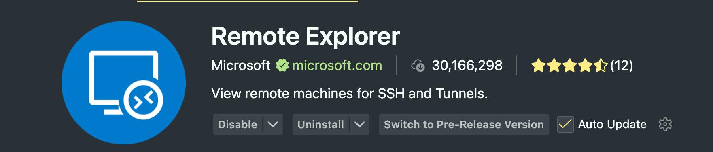
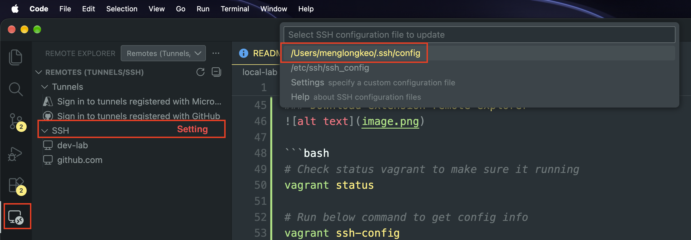

## NOTE
Note related to vagrant and virtualbox 

- Check if your terminal able to use vagrant
```bash
which vagrant 
vagrant --version 
# window or linux 
vagrant init ubuntu/jammy64 

# mac 
vagrant init bento/ubuntu-24.04

# start the vm 
vagrant up
vagrant status 
vagrant ssh-config
vagrant ssh 

# shutdown 
vagrant halt 
vagrant destroy -f # delete the vm 

# reload the inline script 
vagrant reload --provision
```
### To fix data not sync with data folder(workplace) in VM

```bash
# uncomment below config line
Vagrant.configure("2") do |config|

# add below line
  if Vagrant.has_plugin?("vagrant-vbguest")
    config.vbguest.auto_update = false
  end

# uncomment and add type
config.vm.synced_folder "./data", "/home/vagrant/workspace", type:"sshfs"

# uncomment below line
config.vm.synced_folder ".", "/vagrant", disabled: true
```

### Download extension remote explorer


```bash
# Check status vagrant to make sure it running
vagrant status

# Run below command to get config info
vagrant ssh-config

# go to remote explorer and past ssh-config to the top
```

